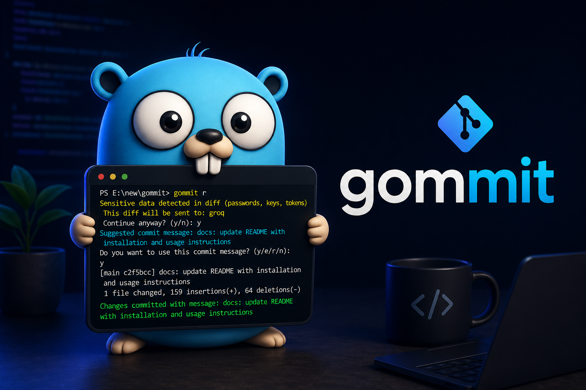

<div align="center">



# Gommit ⚡

> AI-powered git commit message generator — single binary, no Node required

</div>
---

## The Problem

Writing good commit messages is something every developer knows they should do — but almost nobody does consistently.

You finish a fix, you're tired, you type `git commit -m "fix"` and move on. Three weeks later you're debugging and your git history is full of `update`, `fix`, `changes`, `wip`. You have no idea what anything does.

Every existing AI commit tool requires Node.js — which means npm, a runtime, and dozens of packages just to get a single CLI utility. Half the time it breaks because of Node version conflicts.

**gommit solves both problems:**
- Reads your staged diff and generates a proper, descriptive commit message using AI
- Ships as a single binary — no Node, no npm, no runtime, no dependencies
- Works on Windows, Mac, and Linux out of the box
- Supports 5 AI providers including free options and fully offline local models

---

## Install

### Windows

```bash
# requires Go installed — https://go.dev/dl/
go install github.com/jagadeesh-2006/gommit@latest
```

Or download the binary directly from [Releases](https://github.com/jagadeesh-2006/gommit/releases/latest):
1. Download `gommit_windows_amd64.zip`
2. Extract `gommit.exe`
3. Move to a folder in your PATH:
```bash
copy gommit.exe %USERPROFILE%\go\bin\
```
4. Open a new terminal and run `gommit init`

---

### macOS

```bash
# requires Go installed — https://go.dev/dl/
go install github.com/jagadeesh-2006/gommit@latest
```

Or download from [Releases](https://github.com/jagadeesh-2006/gommit/releases/latest):
```bash
# Intel Mac
curl -L https://github.com/jagadeesh-2006/gommit/releases/latest/download/gommit_darwin_amd64.tar.gz | tar xz
sudo mv gommit /usr/local/bin/

# Apple Silicon (M1/M2/M3)
curl -L https://github.com/jagadeesh-2006/gommit/releases/latest/download/gommit_darwin_arm64.tar.gz | tar xz
sudo mv gommit /usr/local/bin/
```

---

### Linux

```bash
# requires Go installed — https://go.dev/dl/
go install github.com/jagadeesh-2006/gommit@latest
```

Or download from [Releases](https://github.com/jagadeesh-2006/gommit/releases/latest):
```bash
curl -L https://github.com/jagadeesh-2006/gommit/releases/latest/download/gommit_linux_amd64.tar.gz | tar xz
sudo mv gommit /usr/local/bin/
```

---

### Build from Source

```bash
git clone https://github.com/jagadeesh-2006/gommit.git
cd gommit
go mod tidy
go build -o gommit .

# mac/linux
sudo mv gommit /usr/local/bin/

# windows
copy gommit.exe %USERPROFILE%\go\bin\
```

---

## Quick Start

### Step 1 — Setup

```bash
gommit init
```

```
Enter your AI provider (anthropic, groq, openai, gemini, ollama): groq
Enter your API key: gsk_xxxxxxxxxxxx
Fetching models...
Available models:
1. llama-3.3-70b-versatile
2. llama-3.1-8b-instant
3. mixtral-8x7b-32768
Select a model number: 1
Commit style (conventional, simple, emoji): conventional
✅ Config saved. Run `gommit run` in any repo.
```

### Step 2 — Stage your changes

```bash
git add .
```

### Step 3 — Generate and commit

```bash
gommit run
```

First, provide optional context about your changes:
```
Why did you make this change? (optional, press Enter to skip): Added JWT refresh token for better session management
```

Then choose from 3 AI-generated suggestions:
```
  1. feat(auth): add JWT token refresh for session management
  2. feat: implement automatic token refresh mechanism
  3. refactor(auth): improve token lifecycle handling

Select (1/2/3), [r] regenerate, [e] edit, [n] cancel: 
```

**Options:**
- `1/2/3` — select and commit that message
- `[e]` — edit a message with interactive text editing
  - Select which message to edit (1/2/3)
  - Opens interactive line editor with the message content
  - Use arrow keys to move cursor, backspace to delete, type to add/modify text
  - Press Enter when done
- `[r]` — regenerate 3 new suggestions
- `[n]` — cancel without committing

**Example edit:**
```
Original: feat(auth): add JWT token refresh
Edit: > feat(auth): add JWT token refresh for better session handling
↑ Added "for better session handling" and committed
✅ Committed: feat(auth): add JWT token refresh for better session handling
```

---

## Commands

| Command | Alias | Description |
|---|---|---|
| `gommit init` | `i` | First time setup wizard |
| `gommit run` | `r` | Generate AI commit message and commit |
| `gommit config` | `cfg` | View current configuration |
| `gommit update` | `u` | Update any configuration value |
| `gommit prompt` | `p` | Set custom prompt instructions |
| `gommit undo` | `un` | Undo last commit, keep changes staged |
| `gommit uninstall` | `remove` | Remove gommit configuration |

---

### `gommit init`
First time setup. Walks you through choosing a provider, entering your API key, selecting a model, and setting a commit style.

```bash
gommit init
```

---

### `gommit run`
Reads your staged diff, sends to AI, suggests a commit message, and commits on your approval.

```bash
git add .
gommit run
```

---

### `gommit config`
View your current saved configuration.

```bash
gommit config
```
```
Current Configuration:
  Provider:      groq
  Model:         llama-3.3-70b-versatile
  API Key:       gsk_xxxx****
  Commit Style:  conventional
  Custom Prompt: none
```

---

### `gommit update`
Update any config value without re-running init.

```bash
gommit update
```
```
Select the setting you want to update:
1. Provider + model + API key
2. Model
3. API Key
4. Commit Style
5. Custom Prompt
```

---

### `gommit prompt`
Set custom instructions for how you want your commit messages generated.

```bash
gommit prompt
```
```
Current prompt: none
Enter your prompt instructions: keep messages under 50 chars, focus on why not what
✅ Prompt saved.
```

---

### `gommit undo`
Made a bad commit? Undo it and keep your changes staged — ready to recommit immediately.

```bash
gommit undo
```
```
✅ Last commit undone — changes are still staged
```

---

### `gommit uninstall`
Remove gommit configuration from your machine.

```bash
gommit uninstall
```
```
⚠ Are you sure you want to remove gommit config? (y/n): y
✅ gommit config removed successfully.

Note: Binary is still installed. To fully remove:
  Windows:   del %USERPROFILE%\go\bin\gommit.exe
  Mac/Linux: rm /usr/local/bin/gommit
```

---

## Supported Providers

| Provider | Free | API Key | Internet | Get Key |
|---|---|---|---|---|
| Groq | ✅ Free | Required | Yes | [console.groq.com](https://console.groq.com) |
| Gemini | ✅ Free tier | Required | Yes | [aistudio.google.com](https://aistudio.google.com) |
| Ollama | ✅ Free | ❌ None | ❌ No | [ollama.com](https://ollama.com) |
| Anthropic | ❌ Paid | Required | Yes | [console.anthropic.com](https://console.anthropic.com) |
| OpenAI | ❌ Paid | Required | Yes | [platform.openai.com](https://platform.openai.com/api-keys) |


> **Privacy focused?** Use Ollama — runs fully offline on your machine, nothing leaves your computer.

---

### Setting up Ollama

```bash
# 1. install ollama
# download from https://ollama.com

# 2. pull a model
ollama pull llama3

# 3. run gommit init and pick ollama
gommit init
# → provider: ollama
# → no API key needed
# → picks from your locally installed models
```

---

## Commit Styles

| Style | Example Output |
|---|---|
| `conventional` | `feat(auth): add JWT token refresh logic` |
| `simple` | `add JWT token refresh logic` |
| `emoji` | `✨ add JWT token refresh logic` |
| `any` | define your own style via `gommit prompt` |

---

## Configuration

Stored at `~/.gommit/config.json` — never shared, never transmitted beyond your chosen AI provider.

```json
{
  "version": "1",
  "provider": "groq",
  "model": "llama-3.3-70b-versatile",
  "api_key": "gsk_xxxxxxxxxxxx",
  "commit_style": "conventional",
  "custom_prompt": ""
}
```

---

## Troubleshooting

**"run gommit init first"**
→ No config found. Run `gommit init` to set up.

**"no staged changes found"**
→ Stage your files first with `git add .`

**"invalid provider"**
→ Supported: `groq`, `anthropic`, `openai`, `gemini`, `ollama`

**"error fetching models"**
→ API key may be invalid. Run `gommit update` → option 3 to fix it.

**"rate limit exceeded"**
→ Wait a moment or switch provider with `gommit update`.

**"model returned empty response"**
→ Model may not support chat. Run `gommit update` → option 2 and pick a different model.

**"could not reach provider"**
→ Check your internet connection or try again later.

**"ollama not running"**
→ Start ollama with `ollama serve` then try again.

**"no models found" (ollama)**
→ Pull a model first with `ollama pull llama3`

---

## Security

- API keys stored at `~/.gommit/config.json` with `0600` permissions — owner read only
- Git diffs sent **only** to your chosen AI provider — never to any gommit server
- gommit has no backend — everything runs entirely on your machine
- Sensitive data in diffs (passwords, tokens, keys) triggers a warning before sending
- Prompts are open source — what you see in code is exactly what gets sent to the AI
- Use Ollama for complete privacy — zero data leaves your machine

---

## Uninstall

```bash
# step 1 — remove config and settings
gommit uninstall

# step 2 — remove binary

# windows
del %USERPROFILE%\go\bin\gommit.exe

# mac/linux
rm /usr/local/bin/gommit
```

---

## What's Next

## What's in v0.2.0
- 3 commit message suggestions at once
- Smart regeneration — avoids repeating previous messages
- Context input — tell gommit why you made the change
- Commit style package with proper type definitions
- Interactive edit mode — modify messages character-by-character with readline

**Performance & Scalability (v0.3.0):**
- Large diff handling — automatic truncation and compression for diffs over 8000 characters
- Token budget optimization — smart allocation across diff, context, and prompt
- Non-blocking commits — goroutines for parallel operations, user doesn't wait during git commit
- Parallel config loading — load global + per-repo config in parallel
- AI request with timeout — cancel long-running requests with Ctrl+C

**Features (v0.4.0+):**
- Per-repo config — different provider/style per project via `.gommit.json` in repo root
- PR description generator — `gommit pr` generates full pull request descriptions
- Commit feedback learning — when you cancel with `n`, gommit learns what you didn't like
- Homebrew support — `brew install gommit`
- Team config sharing — commit `.gommit.json` to share style across your team
- Git hooks integration — runs automatically on every `git commit`, no manual `gommit run` needed


**Have an idea or found a bug?**
→ [Open an issue](https://github.com/jagadeesh-2006/gommit/issues) — all suggestions welcome

---

## Contributing

PRs are welcome. Please open an issue first for major changes.

```bash
# 1. fork the repo

# 2. create a feature branch
git checkout -b feature/your-feature

# 3. make your changes and commit
gommit run

# 4. push and open a PR
git push origin feature/your-feature
```

### Developer Documentation

Internal design docs (not committed):
- **QNA.md** — Architecture decisions, "why did we choose this?" Q&A
- **PERFORMANCE.md** — Goroutine usage, large diff handling, token optimization strategies
- **DECISIONS.md** — Technical decision log for future reference

---

## License

MIT — see [LICENSE](LICENSE) for details.

---

**Built with [Cobra](https://github.com/spf13/cobra) · Powered by Groq, Gemini, Anthropic, OpenAI, Ollama**